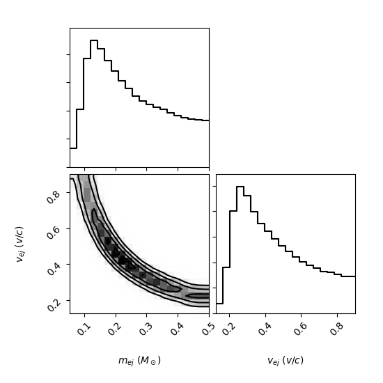

.. EM_PE documentation master file, created by
   sphinx-quickstart on Tue Dec  4 23:24:43 2018.
   You can adapt this file completely to your liking, but it should at least
   contain the root `toctree` directive.

EM PE Documentation
=================================

.. toctree::
   :maxdepth: 2
   :caption: Contents:

   sampler
   plot_utils
   parser
   utils
   low_level_utils

Examples and Usage
------------------

Makefile Examples
^^^^^^^^^^^^^^^^^

A Makefile is provided to generate bash scripts for testing and common PE tasks.
For example, to do a PE run using GW170817 data and the ``woko2017`` model,
run::

    $ make GW170817_woko2017_fixed_dist

To run the parameter estimation and plotting codes::

    $ cd pe_runs/GW170817_woko2017_fixed_dist
    $ sh sample.sh
    $ sh plot_corner.sh
    $ sh plot_lc.sh

The corner plot for this example should look similar to this:

Using Log-Likelihood Function
^^^^^^^^^^^^^^^^^^^^^^^^^^^^^
In addition to full parameter estimation, this code also provides access to the
internal log-likelihood function::

    import numpy as np
    from em_pe import sampler

    dat = "./"
    m = "woko2017"
    f = ["r.txt"]
    out = "placeholder.txt"

    ### Initialize sampler
    s = sampler(dat, m, f, out)

    ### Log-likelihood function takes a dictionary mapping parameter
    ### names to values

    params = {"mej":0.02, "vej":0.3, "dist":40.0}

    ### Evaluate lnL

    lnL = s.log_likelihood(params)

    ### Alternatively, log_likelihood can take arrays of parameter samples

    n = 100

    params = {"mej":np.random.uniform(0.01, 0.04, n),
              "vej":np.random.uniform(0.1, 0.3, n),
              "dist":np.random.uniform(10.0, 80.0, n)}

    lnL = s.log_likelihood(params, vect=True)
