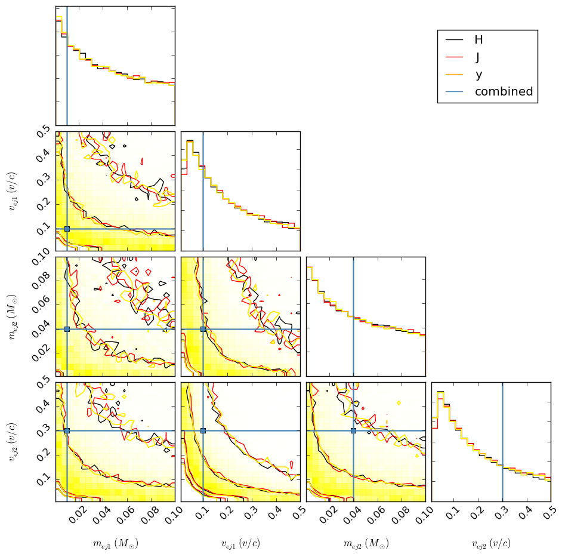
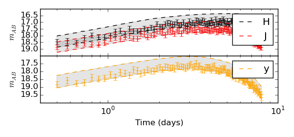

.. EM_PE documentation master file, created by
   sphinx-quickstart on Tue Dec  4 23:24:43 2018.
   You can adapt this file completely to your liking, but it should at least
   contain the root `toctree` directive.

EM PE Documentation
=================================

.. toctree::
   :maxdepth: 2
   :caption: Contents:

   sampler
   plot_utils
   parser
   utils
   low_level_utils

Examples and Usage
------------------

CLI Example for Synthetic Two-Component Data
^^^^^^^^^^^^^^^^^^^^^^^^^^^^^^^^^^^^^^^^^^^^
The following is an example of a bash script that will generate posterior
samples from synthetic data (although these commands could be run directly from
the command line). A two-component model is used, and for simplicity, only three
bands are used::

    ### generate data
    python em_pe/tests/generate_data.py --m two_comp --out temp/ --tmin 0.5 --tmax 8 \
        --n 100 --err 0.2 --p mej1 0.01 --p mej2 0.04 --p vej1 0.1 --p vej2 0.3 \
        --p frac 0.5 --p dist 40

    n=50 # fix number of iterations to something reasonable

    ### assumes temp/H/ directory exists
    ### fix 'frac' parameter to 0.5 and 'dist' parameter to 40.0
    python em_pe/sampler.py --dat temp/ --m two_comp -v \
        --f H.txt \
        --min $n --max $n \
        --out temp/H/posterior_samples.txt \
        --fixed_param frac 0.5 --fixed_param dist 40 &

    ### assumes temp/J/ directory exists
    ### fix 'frac' parameter to 0.5 and 'dist' parameter to 40.0
    python em_pe/sampler.py --dat temp/ --m two_comp -v \
        --f J.txt \
        --min $n --max $n \
        --out temp/J/posterior_samples.txt \
        --fixed_param frac 0.5 --fixed_param dist 40 &

    ### assumes temp/y/ directory exists
    ### fix 'frac' parameter to 0.5 and 'dist' parameter to 40.0
    python em_pe/sampler.py --dat temp/ --m two_comp -v \
        --f y.txt \
        --min $n --max $n \
        --out temp/y/posterior_samples.txt \
        --fixed_param frac 0.5 --fixed_param dist 40

Once the posterior samples are generated, we can make a corner plot and a
lightcurve plot (again as a bash script)::

    ### generate corner plot
    python em_pe/plot_utils/plot_corner.py \
        --posterior_samples temp/H/posterior_samples.txt \
        --posterior_samples temp/J/posterior_samples.txt \
        --posterior_samples temp/y/posterior_samples.txt \
        --out temp/corner.png \
        --combine \
        --truth_file temp/test_truths.txt \
        --legend H \
        --legend J \
        --legend y \
        --p mej1 --p vej1 --p mej2 --p vej2 &

    ### generate lightcurve plot
    python -m em_pe/plot_utils/plot_lc --tmin 0.5 --tmax 8 --out temp/lc.png \
        --posterior_samples temp/H/posterior_samples.txt \
        --posterior_samples temp/J/posterior_samples.txt \
        --posterior_samples temp/y/posterior_samples.txt \
        --b H \
        --b J \
        --b y \
        --lc_file temp/H.txt \
        --lc_file temp/J.txt \
        --lc_file temp/y.txt \
        --m two_comp --fixed_param frac 0.5 --fixed_param dist 40

Python API Example for Synthetic Data
^^^^^^^^^^^^^^^^^^^^^^^^^^^^^^^^^^^^^
The Python equivalent to the previous example. Note that there is not yet a Python
interface for synthetic data generation, so the first command in the above bash
script should be run prior to this::

    from em_pe import sampler
    from em_pe.plot_utils import plot_corner, plot_lc

    b = ['H', 'J', 'y'] # data bands to store
    dir = 'temp/' # directory to store data in

    model = 'two_comp'
    out = 'temp/H/posterior_samples.txt'
    n = 50
    fixed = [['frac', 0.5], ['dist', 40.0]]

    ### Initialize sampler (for H band)
    s = sampler(dir, model, ['H.txt'], out, min_iter=n, max_iter=n, fixed_params=fixed)

    ### Generate samples
    s.generate_samples()

    ### Initialize sampler (for J band)
    s = sampler(dir, model, ['J.txt'], out, min_iter=n, max_iter=n, fixed_params=fixed)

    ### Generate samples
    s.generate_samples()

    ### Initialize sampler (for y band)
    s = sampler(dir, model, ['y.txt'], out, min_iter=n, max_iter=n, fixed_params=fixed)

    ### Generate samples
    s.generate_samples()

    samples = ['temp/H/posterior_samples.txt',
               'temp/J/posterior_samples.txt',
               'temp/y/posterior_samples.txt']
    out = temp/corner.png
    params = ['mej1', 'vej1', 'mej2', 'vej2']
    leg = ['H', 'J', 'y']

    ### Make a corner plot
    plot_corner.generate_corner_plot(samples, out, params, leg=leg)

    tmin = 0.5
    tmax = 8.0
    lc_file = ['temp/H.txt', 'temp/J.txt', 'temp/y.txt']

    ### Make a lightcurve plot
    plot_lc.generate_lc_plot(samples, out, model, tmin, tmax, b, lc_file=lc_file, fixed_params=fixed)

The plots generated should be similar to:

Using Log-Likelihood Function
^^^^^^^^^^^^^^^^^^^^^^^^^^^^^
In addition to full parameter estimation, this code also provides access to the
internal log-likelihood function::

    from em_pe import sampler

    dat = './'
    m = 'two_comp'
    f = ['H.txt', 'J.txt']
    out = 'placeholder.txt'

    ### Initialize sampler
    s = sampler(dat, m, f, out)

    ### Log-likelihood function takes a dictionary mapping parameter
    ### names to values

    params = {'mej1':0.01, 'mej2':0.04, 'vej1':0.1, 'vej2':0.3, 'frac':0.5, 'dist':40.0}

    ### Evaluate lnL

    lnL = s.log_likelihood(params)

    ### Alternatively, log_likelihood can take arrays of parameter samples

    n = 100

    params = {'mej1':np.random.uniform(0.01, 0.04, n),
              'mej2':np.random.uniform(0.01, 0.04, n),
              'vej1':np.random.uniform(0.1, 0.3, n),
              'vej2':np.random.uniform(0.1, 0.3, n),
              'frac':np.random.uniform(0.3, 0.7, n),
              'dist':np.random.uniform(30.0, 50.0, n)}
    
    lnL = s.log_likelihood(params, vect=True)
