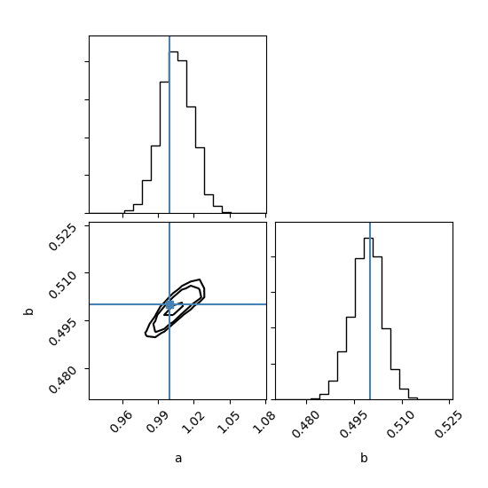
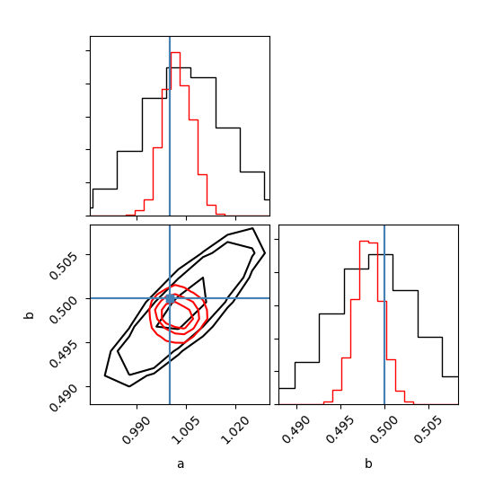

Examples and Usage
------------------
To run a simple one-band test using a fake model and data, run the included script
``run_tests.sh``::

    $ sh run_tests.sh

This test will generate and save data from an artificial model, generate posterior
samples, and plot a corner plot of these samples (with truth lines). All data, samples,
and plots are saved in ``em_pe/tests/Data/``. The corner plot produced should look similar
to:

In general, assuming data is already properly formatted, generate posterior samples::

    $ python em_pe/generate_posterior_samples.py --dat [data location] --m [model] [weight] --f [data file] --out [posterior sample file] --cutoff [L cutoff value]

Multiple models and data files can be provided by adding them as additional arguments.
To generate a corner plot::

    $ python em_pe/plot_utils/plot_corner.py --p [param name] --posterior_samples [posterior sample file] --out [filename of plot] --truth_file [truth file]

Multiple parameter names can be (and usually are) specified. If multiple posterior
sample files are specified, plots will be overlaid using a different color. A truth file
does not have to be provided if truth lines are not desired. For example, here is a
corner plot using two sets of posterior samples, the first (in black) generated from a
single-band model and the second (in red) generated from a two-band model:

